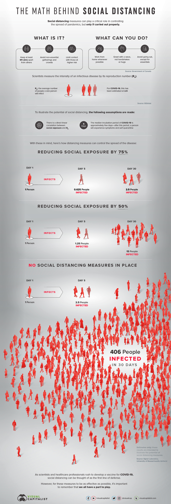
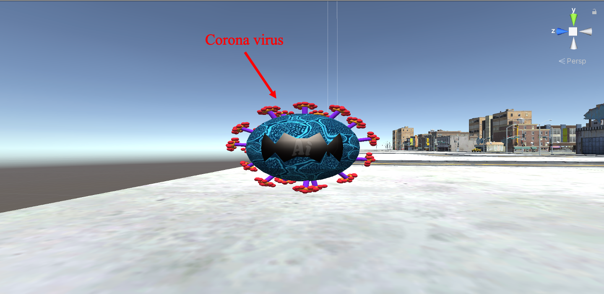
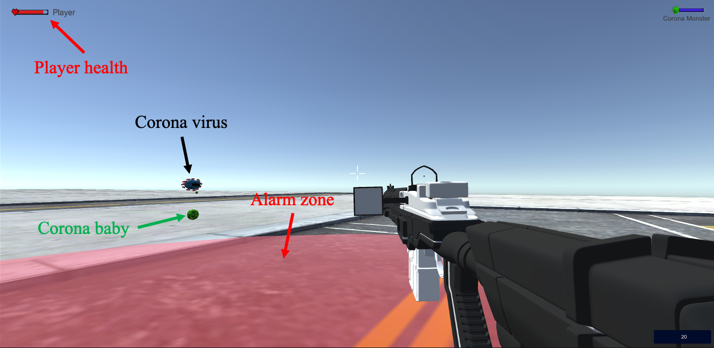
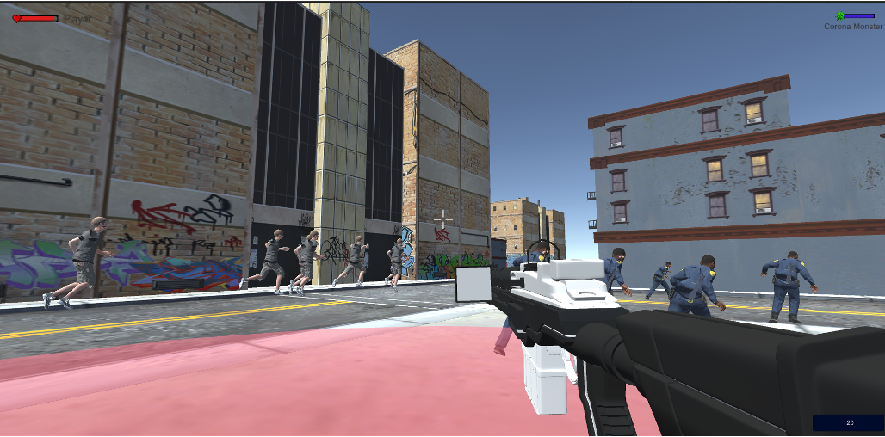
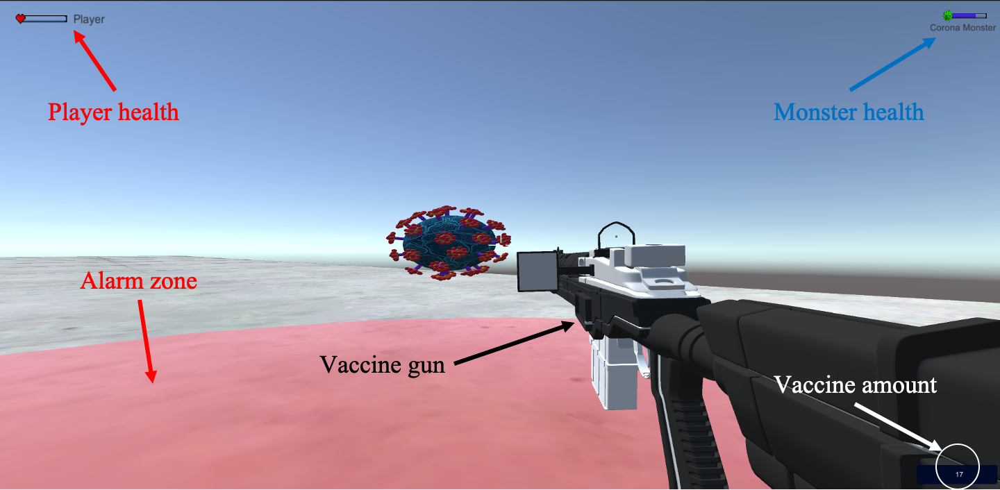

# VR-project2-BAB

## Video

## Group members
1. Benjamin Paul (leader)
2. Aditi Misra
3. Bao Dien Quoc Nguyen

## Member duty

## The game idea

**Overview:**

This VR game simulates how we are fighting the Covid-19 in an enjoyable way. In the game, we integrate some educational aspects to prevent Corona virus and save our lives such as washing hand by sanitizers, wearing face masks, or social distance. The game happens in a city with three class of characters: a monster, people on the street, and a player. The player needs to kill the monster before being killed to win the game.

After implementation phase, we slightly modify the idea with the replacement of sanitizers by vaccines.

**Project evaluation:**

1. Innovative and Transformative (20%): we transform human fight again Covid-19 to a shooting VR game. Some facts related to Covid-19 are transformed to objects in game.

2. Educating (10%): the science behind our game: wearing mask and social distance can help avoid the damage from virus. The knowledge of wearing mask and social distance can be seen in below figures.

3. Interesting (10%): it is interesting to find and kill the virus while avoiding being infected.

4. Visual appealing (10%): we can see buildings, the vaccine gun, people on the street with many visual details.

5. Sound effect (10%): real sounds to make the game more interesting: walking, the crowd yields, the monster's sound, ...

6. Usability (10%):the game can work smoothly.

7. Technical challenging (10%): all features/functions in the next section.

8. Effort (10%): we all have little experience in Unity, so completing the game demo takes lots of our efforts.

9. Teamwork (10%): see the peer evaluation.

The science of wearing mask

The science of social distance

## The game features

**1. The Corona monster**

Visual appealing of the monster:

Features:

- Emit Corona baby every 15 seconds.

- Corona baby automatically moves toward the player to cause damage.

- Corona baby disappears after 20 seconds.

- Corona baby infects the player if it goes to the alarm zone (6 feets).

**2. The crowd:**

Features:

- People on the street are cloned randomly during the game.

- They automatically run away from the virus.

**3. The player:**

Features:

- Hold the vaccine gun to kill the monster. The gun has a certain amount of vaccine.

- Can wear mask to block damage from the virus and anyone that is infected by the virus.

- If the player is infected by the virus, his health reduces.

- The player can shoot the virus by his vaccine gun to kill it.

- The alarm zone gives information for the player to manage his move.

## References

- Monster: Blender, Unity.

- City people: using [Mixamo](https://www.mixamo.com/#/?page=1&type=Character)

- Buildings: (https://sketchfab.com/3d-models/ccity-building-set-1-a2d5c7bfcc2148fb8994864c43dfcc97)

- Vaccine gun: (https://free3d.com/3d-model/energy---m14-713978.html)

- Game music: (https://gamethemesongs.com/Assassins_Creed_Origins___Winds_of_Cyrene.html)

- Monster music: (https://www.shockwave-sound.com/sound-effects/monster-sounds/Monster%20Scream.wav)

- Healthbar png: (http://pngimg.com/download/51337)

- Maskbar png: (https://cdn0.iconfinder.com/data/icons/virus-medical/567/virus_wearing_mask-512.png)

- Monsterbar png: (http://pngimg.com/uploads/coronavirus/coronavirus_PNG7.png)
